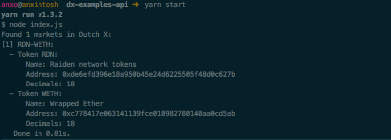

<p align="center">
  
</p>


# API Usage - DutchX
This is a simple project that shows how to use the DutchX API.

The API is an alternative and easier access to the information on
the smart contracts.

It was built to make the information more accessible, so it hides the barriers 
that a newcomer may find in the Ethereum development.

# Documentation
The API and it's documentation is avaliable for:
  * **Mainnet**: [https://dutchx.d.exchange/api](https://dutchx.d.exchange/api)
  * **Rinkeby**: [https://dutchx-rinkeby.d.exchange/api](https://dutchx-rinkeby.d.exchange/api)
  
Check out also the [DutchX Documentation](http://dutchx.readthedocs.io/en/latest)

## Getting started
To get started, you just have to make a regular REST call using any http client.

For example, in node you could use [got](https://www.npmjs.com/package/got) to 
make the http requests:

```bash
yarn add got --save # Or: npm install got  --save
```

Then we can invoke any of the Api operations. 

For example, to get the complete list of tokens pairs (markets) that has been 
added to the DutchX we can use the `/markets` endpoint:

```js
got = require('got');
const { body: markets } = await got('https://dutchx.d.exchange/api/v1/markets', {
  json: true
})
```

The complete example can be seen in [here](index.js).

You can run it with:
```bash
yarn start # Or: npm start
```

We should see as a result the list of tokens:




# Contributors
- Stefan ([Georgi87](https://github.com/Georgi87))
- Martin ([koeppelmann](https://github.com/koeppelmann))
- Anxo ([anxolin](https://github.com/anxolin))
- Dani ([dasanra](https://github.com/dasanra))
- Dominik ([dteiml](https://github.com/dteiml))
- David ([W3stside](https://github.com/w3stside))
- Dmitry ([Velenir](https://github.com/Velenir))
- Alexander ([josojo](https://github.com/josojo))